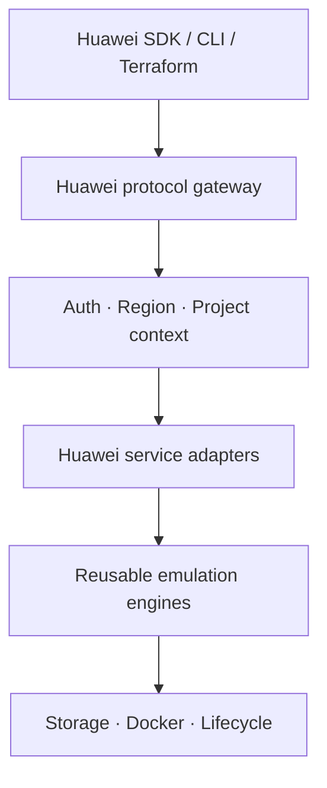

# Huawei Cloud provider architecture

**Status:** Accepted for planning  
**Decision date:** 2026-08-28

## Context

Upstream Floci is an AWS-compatible local cloud emulator. It does not contain a generic provider
plug-in system: AWS concepts are embedded in request routing, SigV4 authentication, credential
scopes, ARNs, service models, CloudFormation resources, errors, documentation, and compatibility
tests.

Adding Huawei Cloud is therefore not a matter of registering another provider. Huawei Cloud has
its own endpoints, signing rules, project and domain identity model, service APIs, resource IDs,
error envelopes, and SDK behavior.

## Decision

Floci Huawei Cloud will be developed as an independent companion distribution. It will preserve
the upstream Git history and MIT attribution, but it will have its own roadmap, releases, and
compatibility contract.

The project will implement Huawei Cloud APIs as a first-class protocol surface. Applications must
be able to use supported Huawei Cloud SDKs and tools by overriding their endpoints; callers will
not be required to translate Huawei requests into AWS requests.

Existing Floci implementations may be reused as internal emulation engines, but Huawei-facing
controllers and models will follow Huawei Cloud contracts. For example, OBS may reuse durable
object-storage primitives from S3, and FunctionGraph may reuse the Lambda container lifecycle,
while exposing Huawei request and response formats.

## Target architecture

### Layer responsibilities

| Layer | Responsibility |
|---|---|
| Protocol gateway | Route Huawei service endpoints and preserve wire-level behavior |
| Request context | Resolve AK/SK identity, region, project ID, domain ID, request ID, and tracing |
| Service adapter | Implement Huawei operations, validation, errors, pagination, and resource models |
| Emulation engine | Execute provider-neutral storage, messaging, compute, or container behavior |
| Runtime | Supply persistence, Docker lifecycle, networking, ports, and shutdown handling |

## Compatibility contract

A Huawei service is considered supported only when:

1. An official Huawei Cloud SDK can call its supported operations through a local endpoint.
2. Request signing, headers, paths, payloads, status codes, and error responses match the documented
   Huawei behavior needed by the supported SDKs.
3. Resources are isolated by region and project where the real service is scoped that way.
4. State follows the configured Floci storage mode.
5. Automated tests cover success, validation, not-found, conflict, and pagination behavior.
6. Known deviations are documented next to the service.

## Boundaries

- This project is Huawei-specific, not a generic multi-cloud abstraction framework.
- AWS compatibility remains unchanged until a Huawei replacement is ready and tested.
- Huawei service names will not be implemented as aliases for unrelated AWS APIs.
- No real Huawei Cloud credentials are required for local emulation.
- Real cloud proxying is outside the initial MVP.
- Large package renames or broad refactors require a separate architecture decision.

## Upstream relationship

The upstream repository is retained as a fetch-only Git remote. Upstream fixes may be selectively
merged when they improve shared runtime behavior. Huawei-specific changes are maintained only in
this repository and will not be pushed to upstream Floci.

